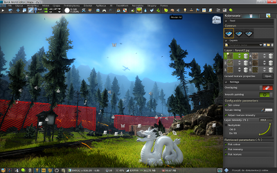

## Screenshots

As GLFW doesn't itself render anything and uses only standard window manager
decorations, there is little to show of GLFW itself.

Instead, here is a small showcase of software using GLFW.

If you feel your application should be listed here, please
[contact us](community.html).

---
### AntTweakBar

<a href="http://www.antisphere.com/Wiki/tools:anttweakbar">AntTweakBar</a> is a small and
easy-to-use C/C++ library that allows one to quickly add a light and intuitive
GUI into graphic applications based on OpenGL, DirectX 9 or DirectX 10 to
interactively tweak their parameters on-screen.

<em>Screenshot Copyright © Philippe Decaudin</em>

---
### Barok Engine

<a href="http://barokengine.com/">Barok Engine</a> is a free, homemade engine with built-in
tools that allows for the creation of massive, open world scenery rich in
content.

<em>Screenshot Copyright © Kamil Nowakowski</em>

---
### Grand Central

<a href="http://pouet.net/prod.php?which=50691">Grand Central</a> is a multi-platform PC
demo by Outbreak, released at Icons 2008.

---
### Horde3D

<a href="http://www.horde3d.org/">Horde3D</a> is Horde3D is a small Open Source 3D
rendering engine, intended to offer the visual effects expected in
next-generation games while at the same time being as lightweight and
conceptually clean as possible.

<em>Screenshot Copyright © Nicolas Schulz</em>

---
### The Polynomial

<a href="http://dmytry.pandromeda.com/games/">The Polynomial</a> is a 3D spaceflight music
game with abstract, mathematically generated scenery and models which are set to
the music of your choice. You fly around in a very strange universe, shoot the
enemies, meet and protect the friends, collect bonuses, fly through wormholes,
and so on, all while rocking out to the music.

<em>Screenshot Copyright © Dmytry Lavrov</em>

---
### VSXu

<a href="http://vsxu.com/">VSXu</a> is a free tool to visually connect modules that perform
rendering and mathematical tasks to build graphical effects that react to music
in realtime or sequenced over time.

