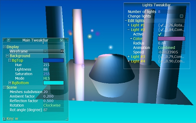
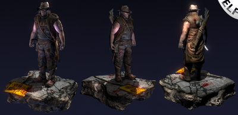
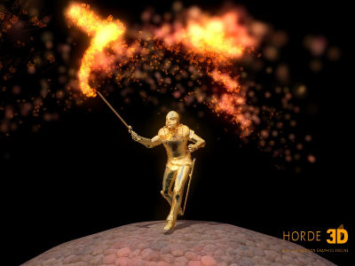
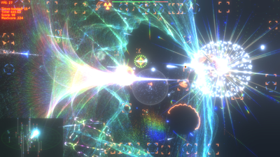

## Screenshots

As GLFW doesn't itself render anything and uses only standard window manager
decorations, there is little to show of GLFW itself.

Instead, here is a small showcase of software using GLFW.

If you feel your application should be listed here, please
[contact us](community.html).

---
### AntTweakBar

[AntTweakBar](http://www.antisphere.com/Wiki/tools:anttweakbar) is a small and
easy-to-use C/C++ library that allows one to quickly add a light and intuitive
GUI into graphic applications based on OpenGL, DirectX 9 or DirectX 10 to
interactively tweak their parameters on-screen.

*Screenshot copyright &copy; Philippe Decaudin.*

---
### BlendELF

[BlendELF](http://blendelf.com/) is a small, scriptable 3D game engine.

---
### Grand Central

[Grand Central](http://pouet.net/prod.php?which=50691) is a multi-platform PC
demo by Outbreak, released at Icons 2008.

---
### Horde3D

[Horde3D](http://www.horde3d.org/) is Horde3D is a small Open Source 3D
rendering engine, intended to offer the visual effects expected in
next-generation games while at the same time being as lightweight and
conceptually clean as possible.

*Screenshot copyright &copy; Nicolas Schulz.*

---
### The Polynomial

[The Polynomial](http://dmytry.pandromeda.com/games/) is a 3D spaceflight music
game with abstract, mathematically generated scenery and models which are set to
the music of your choice. You fly around in a very strange universe, shoot the
enemies, meet and protect the friends, collect bonuses, fly through wormholes,
and so on, all while rocking out to the music.

*Screenshot copyright &copy; Dmytry Lavrov.*

---
### VSXu

[VSXu](http://vsxu.com/) is a free tool to visually connect modules that perform
rendering and mathematical tasks to build graphical effects that react to music
in realtime or sequenced over time.

